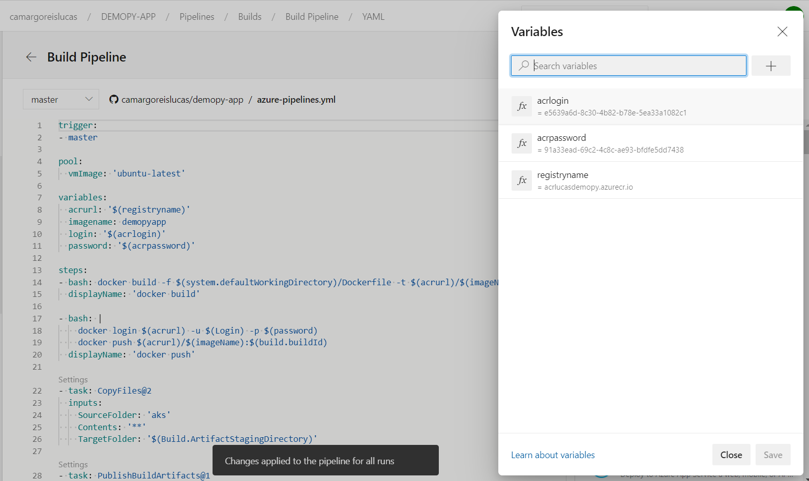
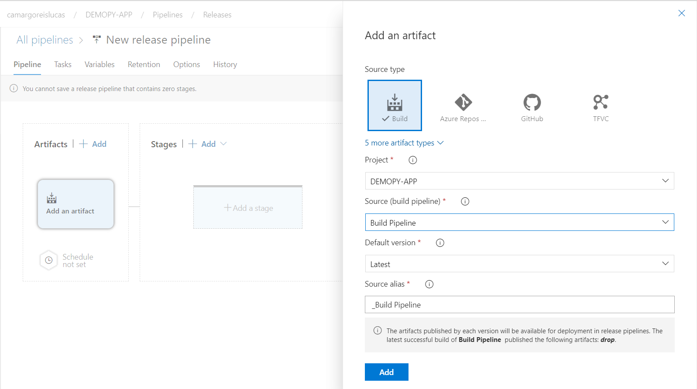
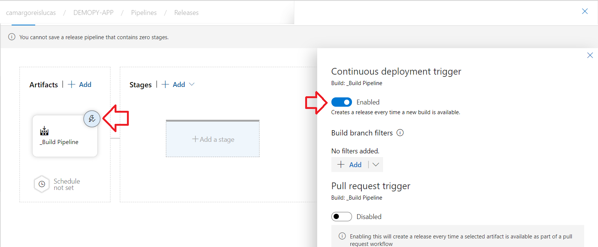
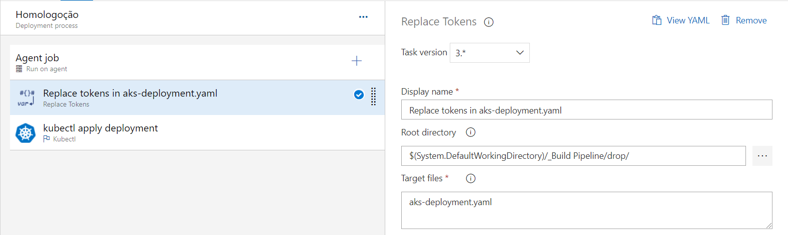
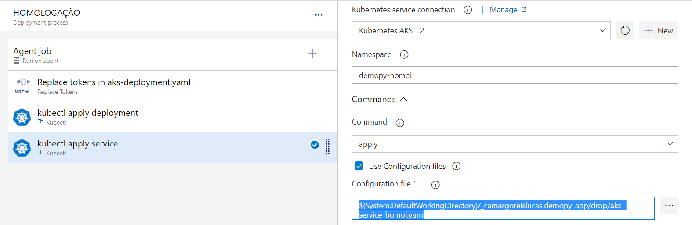
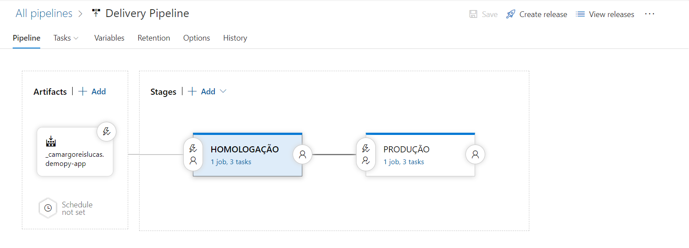

# PIPELINE AZURE DEVOPS + KUBERNETES

## INTRODUÇÃO
Este documento descreve o procedimento utilizado para fazer o deploy de um aplicação de exemplo criada em phyton no Kubernetes utilizando um fluxo automatizado (CI/CD) no Azure Kubernetes Services, os passos do Pipeline são descritos a seguir:

1. Código fone da aplicação e Dockerfile hospedados no Git Hub.

2. Pipeline de build com trigger na branch master realiza o build da aplicação utilizando o Dockerfile e faz o push da imagem de container para um repositório privado no Microsoft Azure.

3. Pipeline de release com trigger no pipeline de build para fazer deploy da nova imagem de container em ambiente de homologação (Namespace kubernetes: demopy-homol) e após autorização o deploy é feito em produção (Namespace Kubernetes: demopy-prod).
    3.1. Acesso a aplicação após deployment em homologação: http://13.86.184.27:5000
    3.2. Acesso a aplicação após deployment em homologação: http://13.86.184.30:5000

## AMBIENTE UTILIZADO

1. Conta do Microsoft Azure.
    
1. Cluster do Azure Kubernetes Services (AKS). 

1. Instância do Azure Container Registry (ACR)- repositório privado para hospedagem de containers.
 
1. Conta de teste no Azure Devops.
    
## DEPLOY DOS RECURSOS NO AZURE

**Passo 01**: Criar grupo de recursos 
Execução do comando az group create para criar um novo grupo de recursos no Microsoft Azure.

```yaml
##Declarar variaveis##
$RG="RGLUCASDEMOPY"
$ACR="ACRLUCASDEMOPY"
$AKS="AKSLUCASDEMOPY"
$Location="westus"

az group create --name $RG --location $location
````

**Passo 02**: Criar Container Registry
Execução do comando az acr create para criar um novo Azure Container Registry (ACR) no grupo de recursos criado no passo anterior.

```bash
az acr create --resource-group $RG --name $ACR --location $location --sku standard
```

`TOMAR NOTA DO CAMPO ACRID `
`Exemplo: $ACRID="/subscriptions/beab887c-2176-4050-a50e-684018d760a9/resourceGroups/RGLUCASDEMOPY/providers/Microsoft.ContainerRegistry/registries/ACRLUCASDEMOPY"`

**Passo 03**: Criar Service Principal para o AKS baixar imagens de containers no ACR
Criar um novo Service Principal utilizando o comando az ad sp create para ser utilizado no passo 04 permitindo que o Azure Kubernetes Services consiga fazer o pull das imagens armazenadas no container registry.

`TOMAR NOTA DOS VALORES APPID E PASSWORD`
   `Exemplo: 
      "appId": "51e4730b-dcdd-4049-bf11-a554c9281d53",
      "password": "77b866b6-7445-4728-acef-15e300e40956"`

**Passo 04**: Criar cluster de AKS
Requisitso declarar variáveis obtidas no passo 02 - ACRID e no passo 03 APPID e PASSWORD e executar o comando az aks create para provisionar um novo cluster de AKS.

```bash
$APPID="51e4730b-dcdd-4049-bf11-a554c9281d53" 
$PASSWORD="77b866b6-7445-4728-acef-15e300e40956"
$ACRID="/subscriptions/beab887c-2176-4050-a50e-684018d760a9/resourceGroups/RGLUCASDEMOPY/providers/Microsoft.ContainerRegistry/registries/ACRLUCASDEMOPY"

az aks create --resource-group $RG --name $AKS --service-principal $appid --client-secret $password --node-vm-size Standard_B2s --node-count 2 --enable-addons monitoring --generate-ssh-keys --location $location 
```

**Passo 05**: Criar Service Principal para o Build do Azure Devops fazer o upload do container para o ACR
Criar um novo Service Principal utilizando o comando az ad sp create para ser utilizado no Pipeline de Build permitindo que o Azure Devpops consiga fazer o pull das imagens armazenadas no container registry.

```bash
az ad sp create-for-rbac -n acrlucasdemopy-pushuri --scopes $ACRID --role acrpush
````
`TOMAR NOTA DOS VALORES APPID E PASSWORD`
   `Exemplo: 
      "appId": "e5639a6d-8c30-4b82-b78e-5ea33a1082c1",
      "password": "91a33ead-69c2-4c8c-ae93-bfdfe5dd7438"`


## CRIAR PIPELINE PARA BUILD DA IMAGEM DE CONTAINER E FAZER O UPLOAD PARA O ACR
Para criação do Pipeline de Build utiliza o Git Hub como fonte do repositorio e utilizar o arquivo .yaml abaixo [azure-pipelines.yml] e declarar as váriveis no pipeline a seguir:

```bash
trigger:
- master

pool:
  vmImage: 'ubuntu-latest'

variables:
  acrurl: '$(registryname)'
  imagename: demopyapp
  login: '$(acrlogin)'
  password: '$(acrpassword)'

steps:
- bash: docker build -f $(system.defaultWorkingDirectory)/Dockerfile -t $(acrurl)/$(imageName):$(build.buildId) $(system.defaultWorkingDirectory)
  displayName: 'docker build'

- bash: |
    docker login $(acrurl) -u $(Login) -p $(password)
    docker push $(acrurl)/$(imageName):$(build.buildId)
  displayName: 'docker push'

- task: CopyFiles@2
  inputs:
    SourceFolder: 'aks'
    Contents: '**'
    TargetFolder: '$(Build.ArtifactStagingDirectory)'

- task: PublishBuildArtifacts@1
  inputs:
    PathtoPublish: '$(Build.ArtifactStagingDirectory)'
    ArtifactName: 'drop'
    publishLocation: 'Container'
    
  ``` 

Variáveis declaradas no Pipeline:

**acrlogin** = *APPID obtido do comando executado na etapa anterior passo 05

**acrpassword** = *password obtido do comando executado na etapa anterior passo 05

**registryname** = *<nomedoazurecontainerregistry>.azurecr.io
  



 ## CRIAR PIPELINE PARA  RELEASE DA IMAGEM DE CONTAINER NO AZURE KUBERNETES SERVICES
Inicie a criação do pipeline de release adicionando um novo artefado disponibilizado através do pipeline de build, o pipeline de build criado no passo anterior entregará como artefados os arquivos .yaml contidos na pasta aks, esses arquivos serão utilizados para o deploy e serviço que serão implantados no Kubernetes.
 
 

habilite o deployment contínuo conforme imagem abaixo:



**O primeiro passo do pipeline conterá 03 atividades:**
01. alterar o valor do arquivo aks-deployment.yaml com o valor da imagem de container atualizada no útimo build, para isso utilizaremos o agent Replace Tokes com as configurações a seguir:
 
  **Root directory** = *$(System.DefaultWorkingDirectory)/_Build Pipeline/drop/
  
  **Target files** = *aks-deployment.yaml


  
 02. deployment do arquivo aks-deployment.yaml no cluster de kubernetes, para isso utilizaremos o agent kubectl com as configurações a seguir:
 
  **Namespace** = *demopy-homol
  
  **comando** = *apply
  
  **Configuration File** = *$(System.DefaultWorkingDirectory)/_Build Pipeline/drop/aks-deployment.yaml

 03. deployment do arquivo aks-service-homol.yaml no cluster de kubernetes, para isso utilizaremos o agent kubectl com as configurações a seguir:
 
  **Namespace** = *demopy-homol
  
  **comando** = *apply
  
  **Configuration File** = *$(System.DefaultWorkingDirectory)/_camargoreislucas.demopy-app/drop/aks-service-homol.yaml
 
 
 
**O segundo passo do pipeline será a cópia do passo anterior alerando apenas as configurações do agente:**

01. alterar o valor do arquivo aks-deployment.yaml com o valor da imagem de container atualizada no útimo build, para isso utilizaremos o agent Replace Tokes com as configurações a seguir:
 
  **Root directory** = *$(System.DefaultWorkingDirectory)/_Build Pipeline/drop/
  
  **Target files** = *aks-deployment.yaml


  
 02. deployment do arquivo aks-deployment.yaml no cluster de kubernetes, para isso utilizaremos o agent kubectl com as configurações a seguir:
 
  **Namespace** = *demopy-prod
  
  **comando** = *apply
  
  **Configuration File** = *$(System.DefaultWorkingDirectory)/_Build Pipeline/drop/aks-deployment.yaml

 03. deployment do arquivo aks-service-homol.yaml no cluster de kubernetes, para isso utilizaremos o agent kubectl com as configurações a seguir:
 
  **Namespace** = *demopy-homol
  
  **comando** = *apply
  
  **Configuration File** = *$(System.DefaultWorkingDirectory)/_camargoreislucas.demopy-app/drop/aks-service-prod.yaml
  
 
 
